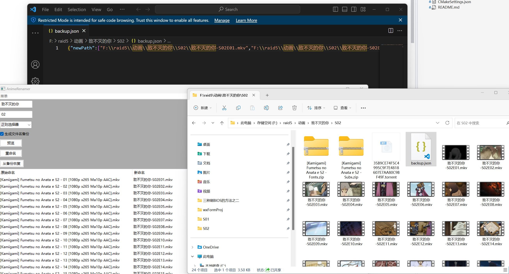

# 动画番剧重命名器

开发目的是方便你更加简便地对各种你收藏下载的动画进行重命名，以方便jellyfin等影音系统进行刮削。

我感觉大家推荐的各种重命名工具都不太好用，就自己开发了一个

不太会写GUI，很丑，大家将就用，希望踊跃提交合并请求

## 编译方式

强烈建议使用vcpkg进行依赖管理，也请使用cmake进行项目构建

使用第三方库有：

* icu（为了unicode的正则表达式）
* libfmt
* wxWidgets
* nolhmann json
* boost的headonly部分

## 当前进度

开发中，有一些bug，但是如果你是开发者，可以尝试使用，最基础功能已经达成

* [X] 对文件夹下的番剧进行重命名(可能会失败)
* [X] 预设多种正则表达式以匹配不同规则的命名
* [X] 对重命名前后的文件名进行备份
* [X] 从备份文件恢复文件名
* [X] 一点点防呆
* [ ] 暂时没有软连接模式，对pt/bt不友好
* [ ] 容易崩溃

## 效果图

